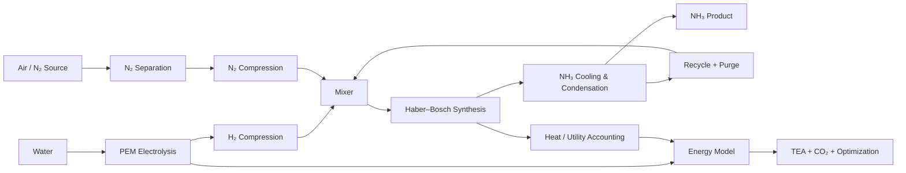
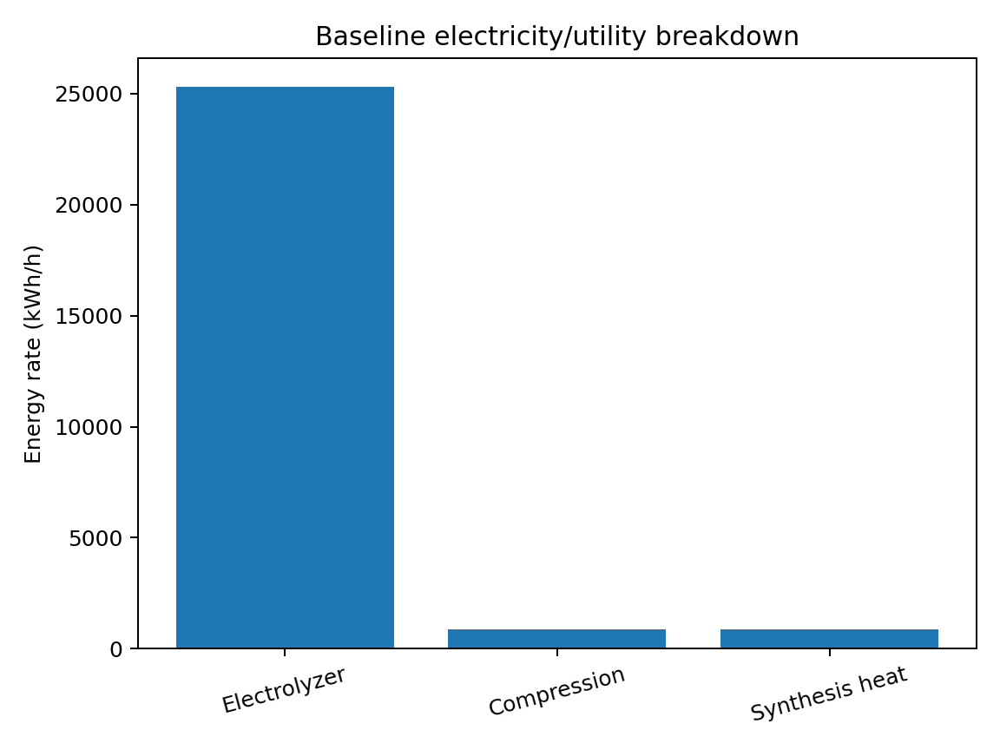
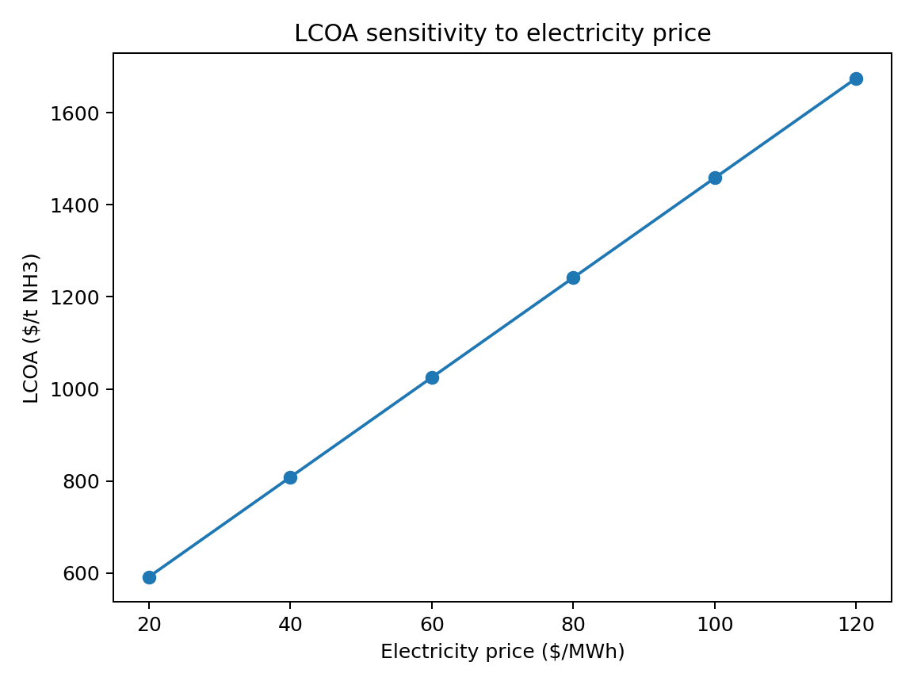

# 🧪 GreenAmmonia-Opt — Green Ammonia Process Design & Techno-Economic Optimization

> **Engineering screening + decision-support dashboard for a green ammonia process using PEM electrolysis, nitrogen separation and Haber–Bosch synthesis.**

[](https://github.com/abhi-iitg/green-ammonia-process-design/actions/workflows/ci.yml)

GreenAmmonia-Opt is a reproducible chemical-engineering screening model for a **20,000 t/y green ammonia plant**. It combines material balances, electrolyzer energy demand, nitrogen recovery, Haber–Bosch synthesis/recycle, compression, heat allowance, techno-economics, carbon intensity, deterministic optimization, sensitivity analysis and an interactive Streamlit dashboard.

The repository is deliberately transparent: assumptions are explicit, calculations are implemented in Python, outputs are reproducible, and an **Aspen Plus validation workflow** is included without fabricating Aspen results.

> **Scope:** This is an engineering screening model, not a replacement for a rigorous Aspen Plus flowsheet, detailed equipment design, vendor quotations, HAZOP/SIL study, or plant commissioning analysis.

---

## 📑 Table of Contents

- [🎯 Product Overview](#-product-overview)
- [🔍 Problem Overview](#-problem-overview)
- [💡 Project Objective](#-project-objective)
- [🏭 Process Overview](#-process-overview)
- [🧩 Process Architecture](#-process-architecture)
- [⚙️ Key Features](#️-key-features)
- [📐 Baseline Design Basis](#-baseline-design-basis)
- [📊 Core Results](#-core-results)
- [💰 Techno-Economic Analysis](#-techno-economic-analysis)
- [🌱 Environmental Analysis](#-environmental-analysis)
- [🔎 Sensitivity & Optimization](#-sensitivity--optimization)
- [📈 Dashboard & Deployment](#-dashboard--deployment)
- [🧪 Aspen Plus Validation](#-aspen-plus-validation)
- [🧪 Testing & Reproducibility](#-testing--reproducibility)
- [📁 Repository Structure](#-repository-structure)
- [🚀 Quick Start](#-quick-start)
- [☁️ Deployment](#️-deployment)
- [⚠️ Engineering Assumptions & Limitations](#️-engineering-assumptions--limitations)
- [🗣️ Interview Talking Points](#️-interview-talking-points)
- [📚 References](#-references)
- [👤 Author](#-author)

---

## 🎯 Product Overview

### What is GreenAmmonia-Opt?

GreenAmmonia-Opt is an **early-stage process design and decision-support tool** that answers:

> **"Given a green-ammonia production target, what process assumptions drive energy consumption, cost and carbon intensity, and which screening-level design point looks economically attractive?"**

The tool connects chemical-engineering calculations to practical engineering decisions:

**Production target → Material balance → Energy model → Economics → Carbon intensity → Optimization → Validation path**

It also provides an interactive dashboard so a reviewer can change key assumptions without editing Python source code.

### Intended users

- Chemical/process engineering students
- Process design and simulation learners
- Techno-economic analysis teams
- Energy-transition researchers
- Recruiters evaluating engineering + analytical problem solving
- Engineers preparing a first-pass Aspen Plus validation

---

## 🔍 Problem Overview

Green ammonia can eliminate fossil-derived hydrogen, but its economics and energy footprint are strongly influenced by:

1. **Hydrogen electricity consumption** from water electrolysis.
2. **Nitrogen recovery and separation energy**.
3. **Haber–Bosch single-pass conversion**, which determines recycle requirements.
4. **High-pressure compression requirements**.
5. **Electricity price**, which can dominate operating cost.
6. **Electricity carbon intensity**, which changes the climate benefit of the product.
7. **CAPEX and utilization**, which affect levelized production cost.
8. **Uncertainty in screening assumptions**, which makes sensitivity analysis essential.

A useful early-stage model therefore needs to do more than calculate one material balance. It should expose the assumptions, quantify trade-offs and identify where rigorous simulation or experimental validation is required.

---

## 💡 Project Objective

The project was designed around five engineering questions:

| Question | Model response |
|---|---|
| How much H₂ and N₂ are required? | Stoichiometric + conversion/recycle balance |
| Where does most energy go? | Electrolyzer + compression + synthesis utility breakdown |
| What drives ammonia cost? | Electricity, OPEX and annualized CAPEX |
| What happens when assumptions change? | Deterministic grid optimization + sensitivity analysis |
| How should the screening model be validated? | Aspen Plus workflow with stream/duty comparison |

---

## 🏭 Process Overview

The conceptual process integrates:

1. **PEM water electrolysis** — produces H₂.
2. **Nitrogen separation** — supplies N₂ with a specified recovery.
3. **Gas compression** — brings synthesis gases to the selected pressure.
4. **Haber–Bosch synthesis** — converts H₂ and N₂ to NH₃.
5. **NH₃ cooling/condensation** — recovers product.
6. **Recycle + purge** — returns unreacted H₂/N₂ while preventing indefinite accumulation.
7. **Utilities and economics** — converts process performance into energy, cost and emissions metrics.

### Reaction basis

\[
N_2 + 3H_2 \rightleftharpoons 2NH_3
\]

---

## 🧩 Process Architecture



### Analytical architecture

```text
                    ┌────────────────────┐
                    │     Parameters     │
                    └─────────┬──────────┘
                              ↓
┌──────────────┐     ┌────────────────────┐
│ Material     │ ──→ │ Energy & Utilities │
│ Balances     │     └─────────┬──────────┘
└──────────────┘               ↓
                       ┌──────────────────┐
                       │ Economics + LCOA │
                       └────────┬─────────┘
                                ↓
                       ┌──────────────────┐
                       │ CO₂ Intensity    │
                       └────────┬─────────┘
                                ↓
                       ┌──────────────────┐
                       │ Optimization     │
                       └────────┬─────────┘
                                ↓
                   ┌─────────────────────────┐
                   │ CSV Results + Figures   │
                   │ + Streamlit Dashboard   │
                   └─────────────────────────┘
```

---

## ⚙️ Key Features

- Stoichiometric H₂/N₂/NH₃ material balances using the 3:1 H₂:N₂ reaction ratio.
- Explicit product-recovery loss accounting.
- Explicit synthesis conversion and recycle/purge accounting.
- PEM electrolyzer electricity model using kWh/kg H₂.
- Nitrogen recovery and gross N₂ feed calculation.
- Compression electricity screening.
- Synthesis heat allowance.
- CAPEX/OPEX screening.
- Capital-recovery-factor annualization.
- LCOA calculation.
- Renewable/grid electricity carbon-intensity scenarios.
- Deterministic grid optimization across five engineering/economic variables.
- Electricity-price sensitivity analysis.
- Reproducible CSV outputs and figures.
- Interactive Streamlit dashboard.
- Automated Python tests.
- GitHub Actions CI workflow.
- Aspen Plus build-and-validation workflow.
- Engineering assumptions and interview guide.

---

## 📐 Baseline Design Basis

| Item | Baseline |
|---|---:|
| NH₃ production | 20,000 t/y |
| Operating time | 8,000 h/y |
| NH₃ product rate | 2,500 kg/h |
| H₂/N₂ stoichiometric ratio | 3.0 mol/mol |
| H₂ electrolyzer electricity | 52 kWh/kg H₂ |
| N₂ recovery | 92% |
| NH₃ single-pass conversion | 18% |
| Product recovery | 99.5% |
| Synthesis pressure | 150 bar |
| Electricity price | $60/MWh |
| Renewable electricity carbon factor | 0.05 kg CO₂e/kWh |
| Grid electricity carbon factor | 0.45 kg CO₂e/kWh |
| CAPEX screening assumption | $42 million |
| Project life | 20 years |
| Discount rate | 10% |

---

## 📊 Core Results

Running:

```bash
python -m src.run_all
```

produces the current deterministic baseline.

### Baseline screening result

| Metric | Result |
|---|---:|
| NH₃ production | **2.50 t/h** |
| Fresh H₂ feed | **486.77 kg/h** |
| Gross N₂ feed | **2,450.77 kg/h** |
| Water feed | **4,600.02 kg/h** |
| Total utility/energy rate | **27,081.10 kWh/h** |
| Specific energy | **10.83 kWh/kg NH₃** |
| LCOA | **$1,025.11/t NH₃** |
| Renewable electricity CO₂ intensity | **0.542 kg CO₂e/kg NH₃** |

The fresh H₂ flow is lower than the reactor-loop H₂ flow because the synthesis model explicitly represents **single-pass conversion plus recycle**.

### Energy split

The baseline energy model is dominated by hydrogen production:

- Electrolyzer: **25,312.26 kWh/h**
- Compression: **893.85 kWh/h**
- Synthesis heat allowance: **875.00 kWh/h**

This is an important engineering conclusion: **electricity consumption for H₂ production is the main screening-level energy driver.**



---

## 💰 Techno-Economic Analysis

The screening LCOA includes:

\[
LCOA =
\frac{Annual\ Electricity + Fixed\ OPEX + Variable\ OPEX + Annualized\ CAPEX}
{Annual\ NH_3\ Production}
\]

### Baseline economics

| Component | Annual value |
|---|---:|
| Electricity cost | ~$13.00 M/y |
| Fixed OPEX | ~$1.47 M/y |
| Variable OPEX | ~$1.10 M/y |
| Annual operating cost | ~$15.57 M/y |
| Annualized CAPEX | ~$4.93 M/y |
| LCOA | **~$1,025/t NH₃** |

These are **screening assumptions**, not vendor quotations or bankable project economics.

---

## 🌱 Environmental Analysis

The model calculates electricity-related cradle-to-gate CO₂ intensity:

\[
CO_2\ intensity =
\frac{Electricity\ consumption \times Carbon\ factor}
{NH_3\ production}
\]

The baseline renewable scenario uses **0.05 kg CO₂e/kWh**.

The model also supports a grid scenario using **0.45 kg CO₂e/kWh**.

### Scope boundary

Included:

- Electricity-related operational emissions.

Excluded:

- Embodied equipment emissions.
- Upstream material emissions.
- Construction emissions.
- Transportation.
- End-of-life emissions.
- Full life-cycle assessment.

Therefore, the environmental result should be interpreted as an **electricity-related screening metric**, not a complete LCA.

---

## 🔎 Sensitivity & Optimization

### Electricity-price sensitivity

The current sensitivity run evaluates:

**$20, $40, $60, $80, $100 and $120/MWh**

At the baseline configuration:

| Electricity price | LCOA |
|---:|---:|
| $20/MWh | ~$592/t |
| $40/MWh | ~$808/t |
| $60/MWh | ~$1,025/t |
| $80/MWh | ~$1,242/t |
| $100/MWh | ~$1,458/t |
| $120/MWh | ~$1,675/t |



### Deterministic grid optimization

The optimizer evaluates:

- Electrolyzer consumption: **48–56 kWh/kg H₂**
- Synthesis pressure: **100–200 bar**
- Single-pass conversion: **12–28%**
- N₂ recovery: **88–96%**
- Electricity price: **$30–90/MWh**

The current grid search contains **1,875 design points**.

The lowest-LCOA point in the predefined screening grid is:

| Variable | Best grid point |
|---|---:|
| H₂ electricity consumption | 48 kWh/kg H₂ |
| Synthesis pressure | 100 bar |
| NH₃ conversion | 28% |
| N₂ recovery | 88% |
| Electricity price | $30/MWh |
| Screening LCOA | **~$665/t NH₃** |

> **Important:** this is a mathematical result inside the predefined screening grid, not an optimized industrial design. In particular, the current pressure variable is retained as a design-space variable for screening, but the present economics model does not assign a pressure-dependent compressor penalty or reactor capital penalty. This is a known model limitation and a priority for a future rigorous model.

---

## 📈 Dashboard & Deployment

The repository includes an interactive **Streamlit** dashboard in `app.py`. The dashboard is designed for scenario exploration without editing the engineering model source code.

### Scenario controls

The sidebar exposes:

- NH₃ production target
- Operating hours
- Electrolyzer electricity consumption
- N₂ recovery
- Single-pass conversion
- Synthesis pressure
- Electricity carbon factor
- Electricity price

### Display controls

The sidebar also provides a dedicated **Display & units** section:

- **Display currency:** USD, EUR, GBP, INR or JPY
- **FX rate:** selected-currency units per USD
- **Energy display:** kWh/h, MWh/h or GWh/y
- **Mass-flow display:** kg/h, t/h, kg/d or t/d

All engineering calculations remain in their native internal units. Currency and unit conversion is applied only to the dashboard presentation and user-facing electricity-price input. This prevents display-unit changes from silently changing the engineering equations.

> **FX note:** the dashboard uses an explicit, editable FX assumption rather than a live exchange-rate API. This keeps the deployment deterministic and usable without external API credentials. Update the FX rate when a different market assumption is required.

### Dashboard outputs

The dashboard displays:

- Production rate with the selected mass-flow unit
- Specific energy
- LCOA in the selected currency per tonne NH₃
- CO₂ intensity
- Material and utility balance with selected flow/energy units
- Energy breakdown with the selected energy unit and percentage share
- Economics table with dynamic currency headers such as `INR/year` and `INR/t NH₃`
- Optimization result with converted economic values
- Best-design CSV download

### Local dashboard

```bash
streamlit run app.py
```

The dashboard should be started from the **repository root**.

### Cloud deployment

See the complete guide:

`docs/deployment.md`

The recommended deployment target is **Streamlit Community Cloud** because the repository contains a root-level `app.py`, `requirements.txt` and `.streamlit/config.toml`.

---

## 💱 Currency & Unit Controls

The dashboard deliberately separates **engineering units** from **display units**. The model calculates internally using USD, kg, kWh and the existing engineering basis. The UI converts values only after the calculations are complete.

### Example

If the model calculates:

```text
LCOA = $1,025.11/t NH₃
```

and the dashboard is set to INR with:

```text
1 USD = 83 INR
```

the displayed value becomes approximately:

```text
₹85,084.24/t NH₃
```

Likewise, an energy rate of `27,081.10 kWh/h` becomes approximately `27.081 MWh/h` or `216.649 GWh/y` at 8,000 operating hours. The underlying model value does not change.

This design fixes a common dashboard error where the number changes but the table heading or chart axis still shows the old unit. The selected currency/unit is now used consistently in metric cards, table headers, charts, material balances and optimization downloads.

## 🧪 Aspen Plus Validation

The repository does **not** fabricate Aspen Plus results.

See:

`aspen/Aspen_Plus_Validation_Workflow.md`

### Recommended validation flow

```text
H₂ Feed ─┐
         ├→ MIX → COMP → HB REACTOR → COOLER → FLASH → NH₃ PRODUCT
N₂ Feed ─┘                         ↑               │
                                  └── RECYCLE ────┘
                                      │
                                    PURGE
```

### Validation targets

Compare Python and Aspen results for:

- NH₃ product kg/h
- H₂ feed kg/h
- N₂ feed kg/h
- NH₃ synthesis rate
- H₂/N₂ recycle
- Compressor duty
- Reactor duty
- Condenser duty
- Product purity
- Overall mass balance

Differences are expected because Aspen uses rigorous thermodynamics and the Python repository uses transparent screening correlations.

---

## 🧪 Testing & Reproducibility

### Automated tests

Run:

```bash
python -m pytest -q
```

The current suite contains **20 automated tests** covering:

- Production-rate scaling
- Stoichiometric relationships
- Nitrogen recovery
- Water-feed positivity
- Energy positivity
- Electrolyzer energy dominance
- LCOA positivity
- Renewable vs. grid emissions
- Conversion bounds
- Model validation
- Optimization result structure
- Optimization minimum selection
- Deterministic optimization
- Production scaling

### Reproducible model run

Run:

```bash
python -m src.run_all
```

This regenerates:

- `results/baseline_results.csv`
- `results/optimization_results.csv`
- `results/best_design.csv`
- `results/electricity_sensitivity.csv`
- `results/energy_breakdown.csv`
- `figures/lcoa_electricity_sensitivity.png`
- `figures/energy_breakdown.png`

### Continuous integration

GitHub Actions runs:

1. Dependency installation.
2. Automated tests.
3. Full reproducible model execution.

Workflow:

`.github/workflows/ci.yml`

---

## 📁 Repository Structure

```text
green-ammonia-process-design/
│
├── app.py                              # Streamlit decision-support dashboard
├── requirements.txt                    # Python dependencies
├── .gitignore
├── .streamlit/
│   └── config.toml                     # Streamlit configuration
│
├── src/
│   ├── __init__.py
│   ├── model.py                        # Material, energy, economics, emissions
│   ├── optimize.py                     # Deterministic grid optimization
│   ├── report.py                       # CSV + figure generation
│   └── run_all.py                      # Reproducible project entry point
│
├── tests/
│   └── test_model.py                   # Automated engineering tests
│
├── results/
│   ├── baseline_results.csv
│   ├── optimization_results.csv
│   ├── best_design.csv
│   ├── electricity_sensitivity.csv
│   └── energy_breakdown.csv
│
├── figures/
│   ├── lcoa_electricity_sensitivity.png
│   └── energy_breakdown.png
│
├── docs/
│   ├── engineering_basis.md
│   ├── deployment.md
│   ├── interview_guide.md
│   └── references.md
│
├── aspen/
│   └── Aspen_Plus_Validation_Workflow.md
│
└── matlab/
    └── sensitivity_notes.m
```

---

## 🚀 Quick Start

### 1. Create a virtual environment

Windows:

```bash
python -m venv .venv
.venv\Scripts\activate
```

Linux/macOS:

```bash
python -m venv .venv
source .venv/bin/activate
```

### 2. Install dependencies

```bash
pip install -r requirements.txt
```

### 3. Run tests

```bash
python -m pytest -q
```

### 4. Generate all model outputs

```bash
python -m src.run_all
```

### 5. Launch the dashboard

```bash
streamlit run app.py
```

---

## ☁️ Deployment

### Recommended: Streamlit Community Cloud

1. Push the complete repository to GitHub.
2. Sign in to Streamlit Community Cloud with GitHub.
3. Create a new app.
4. Select the repository.
5. Select the `main` branch.
6. Set the entrypoint to:

```text
app.py
```

7. Deploy.
8. Test the dashboard using the verification checklist in `docs/deployment.md`.

The root-level `requirements.txt` declares the Python dependencies required by the application, and `.streamlit/config.toml` contains the repository configuration.

### Existing GitHub repository

If this project is **already uploaded to GitHub**, do not recreate the repository. Replace/add these files:

**Replace**

```text
README.md
requirements.txt
.gitignore
```

**Add**

```text
app.py
.streamlit/config.toml
docs/deployment.md
.github/workflows/ci.yml
```

Keep the existing `src/`, `tests/`, `results/`, `figures/`, `docs/`, `aspen/` and `matlab/` content unless you specifically want to replace it with this final package.

After pushing:

```bash
git add .
git commit -m "Add tested Streamlit dashboard and deployment workflow"
git push
```

---

## ⚠️ Engineering Assumptions & Limitations

This project is intentionally a **transparent screening model**.

### Material-balance limitations

- The synthesis loop uses a simplified single-pass conversion representation.
- A fixed purge fraction is used.
- Detailed inert accumulation is not modeled.
- Detailed gas-liquid equilibrium is not modeled.

### Energy limitations

- Electrolyzer demand is represented by a fixed kWh/kg H₂ assumption.
- Compression is a screening correlation rather than a compressor train design.
- Synthesis heat is represented as an allowance.
- Pressure-dependent compressor work is not yet rigorously coupled to the optimization objective.

### Economics limitations

- CAPEX is a screening assumption.
- OPEX is simplified.
- No detailed equipment sizing/cost correlations are included.
- No financing structure, taxes, depreciation or escalation model is included.
- LCOA is not a bankable project-finance estimate.

### Thermodynamics limitations

The equilibrium-conversion function is a transparent screening correlation. It is **not** a fitted industrial catalyst model.

### Validation limitation

No Aspen Plus numerical result should be claimed until the actual Aspen workflow has been executed and the exported results are documented.

---

## 🗣️ Interview Talking Points

This project can support discussion around both **chemical engineering** and **analytical decision making**.

### Chemical engineering

- Why is the H₂:N₂ feed ratio 3:1?
- Why is recycle required?
- Why is a purge required?
- Why does electrolysis dominate energy demand?
- Why does pressure influence ammonia synthesis?
- What is the role of NH₃ condensation?
- How would you validate the process in Aspen Plus?

### Analytics / optimization

- Which assumptions dominate LCOA?
- Why use deterministic grid search?
- How would you handle uncertainty?
- How would you introduce a pressure-dependent compressor model?
- How would you optimize for cost and carbon simultaneously?
- How would you model renewable intermittency?
- What would you change before calling this a bankable TEA?

### Strong engineering answer

> "I intentionally separated the transparent screening layer from the rigorous validation layer. The Python model is useful for fast scenario analysis and optimization, while Aspen Plus should be used to validate thermodynamics, recycle convergence, phase behavior and unit-operation duties before treating the results as design-grade."

---

## 📚 References

See `docs/references.md`.

Key background sources include:

1. Conceptual process design and technoeconomic analysis of an e-ammonia plant: Green H₂ and cryogenic air separation coupled with Haber–Bosch process, *International Journal of Hydrogen Energy* (2024).
2. *Performance of a Small-Scale Haber Process: A Techno-Economic Analysis*, *ACS Sustainable Chemistry & Engineering* (2020).
3. Recent green-ammonia techno-economic optimization literature listed in `docs/references.md`.

---

## 👤 Author

**Abhishek Kumar Gond**  
IIT Guwahati | Chemical Engineering

- **Email : mr.abhishekaaa@gmail.com**
- **[Portfolio]()**
- **[LinkedIn](https://www.linkedin.com/in/abhishekkumargond/)**

This repository demonstrates:

**Process Engineering + Python Modeling + Techno-Economic Analysis + Optimization + Reproducibility + Deployment**

---

## ⭐ Engineering takeaway

The central screening insight is straightforward:

> **For green ammonia, the cost and energy story is strongly driven by electricity-intensive hydrogen production.**

The value of this project is not a single "optimal" number. It is the **reproducible chain from engineering assumptions → process balances → energy → economics → emissions → optimization → validation**.
